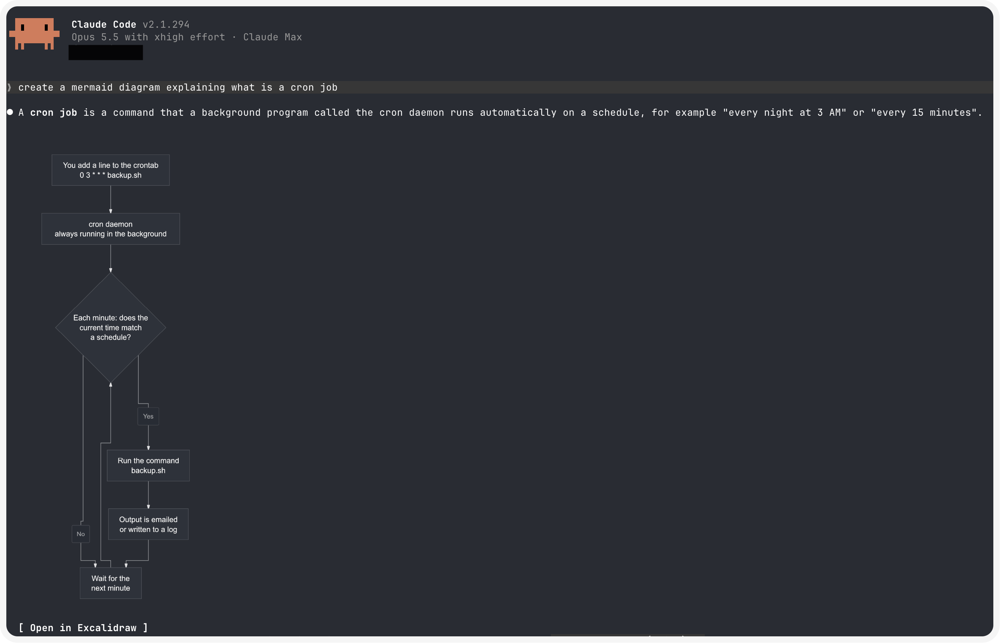

# mermaid-render

A Claude Code mod that draws the ```mermaid blocks of Claude's replies as images in the terminal, and opens them in Excalidraw.



## Install

```bash
brew install resvg
```

Then, in Claude Code:

```
/plugin install mermaid-render --marketplace maxp-riot/mermaid-render
```

## Requirements

- macOS on Apple Silicon, Claude Code 2.1.287 or later.
- Images show in Ghostty, cmux and kitty. In iTerm2 3.7 or later, add `"env": { "CLAUDE_CODE_FORCE_TERMINAL_IMAGES": "1" }` to `~/.claude/settings.json`. Other terminals get box characters.

## Use

- Diagrams follow your Claude Code theme, light or dark (`auto` gets a dark card).
- `Open in Excalidraw` under an image, or `/excalidraw` for the last diagram, opens excalidraw.com with an editable copy. Excalidraw asks before replacing a canvas that holds a drawing. Nothing is uploaded.

## License

MIT. Bundles beautiful-mermaid (MIT), elkjs (EPL-2.0) and entities (BSD-2-Clause), with their licenses.
